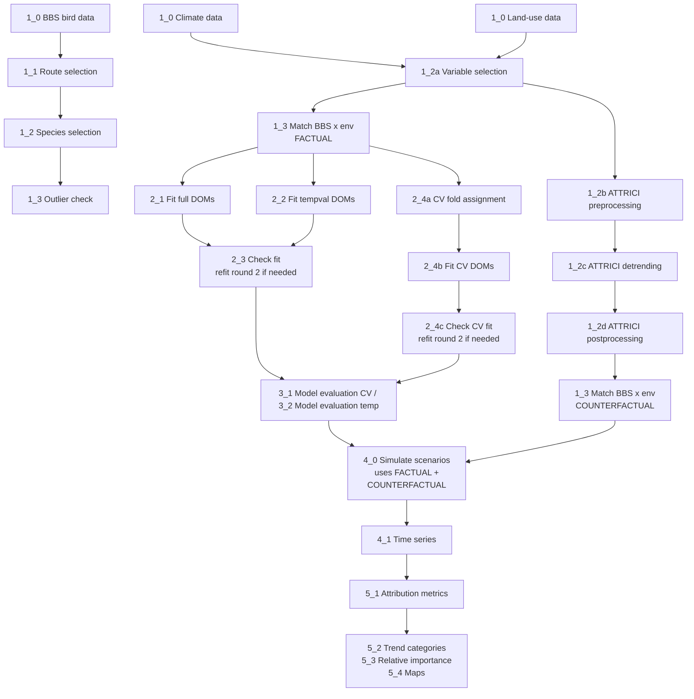

# North American bird occupancy dynamics attributed to climate and land use change


**Authors:** Katrin Schifferle<sup>1</sup>, Natalie J. Briscoe<sup>2</sup>, Guillermo Fandos<sup>3</sup>, Stefanie Heinicke<sup>4</sup>, Christopher P. O. Reyer<sup>4</sup>, Mark C. Urban<sup>5</sup>, Damaris Zurell<sup>1</sup>


**Affiliations:**<br/>
<sup>1</sup> Ecology and Macroecology, University of Potsdam, Germany.<br/>
<sup>2</sup> School of Agriculture, Food, and Ecosystem Sciences, University of Melbourne, Parkville, Vic, Australia.<br/>
<sup>3</sup> Department of Biodiversity Ecology and Evolution, Faculty of Biological Science, Universidad Complutense de Madrid (UCM), Madrid, Spain.<br/>
<sup>4</sup> Potsdam Institute for Climate Impact Research (PIK), Member of the Leibniz Association, Potsdam, Germany.<br/>
<sup>5</sup> Department of Ecology and Evolutionary Biology and Center of Biological Risk, University of Connecticut, Storrs, CT, USA.<br/>


**Funding:** \[funding sources]


**Corresponding author:** Katrin Schifferle: schifferle1@uni-potsdam.de


[!\[License: GPL-3.0](https://img.shields.io/badge/License-GPL%203.0-blue.svg)](LICENSE)


[!\[DOI](https://zenodo.org/badge/DOI/PLACEHOLDER.svg)](https://doi.org/PLACEHOLDER)


## Abstract

[Insert paper abstract here before submission]


## Citation

If you use this code or build on this work, please cite both the paper and the archived code:

> Schifferle, K., et al. (2026). *North American bird occupancy dynamics attributed to climate and land use change.* [Journal], [vol(issue)], [pages]. https://doi.org/[paper-DOI]

> Schifferle, K., et al. (2026). *UP-macroecology/Schifferle_BBS_occupancy_models_attribution_2026* [Code]. Zenodo. https://doi.org/[Zenodo-DOI]


## Workflow




Note three branch points in the workflow:
- **Factual / counterfactual loop** at `1_3_dataprep_match_BBS_routes_env_data.R`: run once with `data <- "factual"` and once with `data <- "counterfactual"`.
- **Refit loop** at `2_1`, `2_2`, `2_4b`: rerun with `round <- 2` for species flagged by the MCMC diagnostic step.
- **ATTRICI** is an external Python CLI (not R) — see "Setting up ATTRICI".


### 0 - Set up and and functions

Script [0\_paths.R](scripts/0_paths.R) defines main directories, expected folder structure and directories of downloaded data.


Script [0\_functions.R](scripts/0_functions.R) defines functions used throughout the analyses.


### 1 - Data preparation


#### Bird data:


scripts [1\_0\_dataprep\_BBS\_bird\_data.R](scripts/1_0_dataprep_BBS_bird_data.R), [1\_1\_dataprep\_BBS\_route\_selection.R](scripts/1_1_dataprep_BBS_route_selection.R), [1\_2\_dataprep\_BBS\_species\_selection.R](scripts/1_2_dataprep_BBS_species_selection.R), [1\_3\_dataprep\_BBS\_outlier\_check\_selected\_species.R](scripts/1_3_dataprep_BBS_outlier_check_selected_species.R)


We fitted dynamic occupancy models (DOMs) based on bird observations from the [North American Breeding Bird Survey](https://www.sciencebase.gov/catalog/item/66d9ed16d34eef5af66d534b) (BBS; Ziolkowski et al. 2024). The BBS contains annual bird counts along 40 km long transects (routes). Observers conduct a three-minute point count of all birds seen within a 400 m radius and all birds heard at 50 stops along the routes, i.e. roughly every 800 m. We used spatial data on the routes from [Patuxent Wildlife Research Center 1999](https://purl.stanford.edu/vy474dv5024). We modelled occupancy at the route level and considered five sections along the route, each containing counts of ten stops, as replicate observations.


We downloaded, cleaned and filtered the BBS data and reformatted them for occupancy modelling (presences and absences for each route section, year and species). We defined the centroid of the route as the route location (script [1\_0\_dataprep\_BBS\_bird\_data.R](scripts/1_0_dataprep_BBS_bird_data.R)).


We limited our analyses to the time period 1995 - 2019 during which a large number of routes was sampled annually. We initially selected the subset of the routes that had been surveyed in at least 20 years, including the first and last year of the time period. These routes were then spatially thinned (minimum distance 100 km) and a maximum of 30 routes per [Bird Conservation Region](https://www.birdscanada.org/bird-science/nabci-bird-conservation-regions) (Bird Studies Canada and NABCI, 2014) was retained to get an equal coverage of the conterminous USA. This resulted in 539 routes (script [1\_1\_dataprep\_BBS\_route\_selection.R](scripts/1_1_dataprep_BBS_route_selection.R)).


Of all species observed in the BBS from 1995 to 2019, we discarded nocturnal and water-related species for which the BBS methodology is not suited. We further excluded rare species that were detected on less than 50 different routes, as well as widespread species, for which there are less than 50 routes where they have never been detected. This resulted 192 species (script [1\_2\_dataprep\_BBS\_species\_selection.R](scripts/1_2_dataprep_BBS_species_selection.R)).


Finally, we checked whether observations of the selected species are plausible and removed few detections located more than 1000 km away from all other detections of a species (script [1\_3\_dataprep\_BBS\_outlier\_check\_selected\_species.R](scripts/1_3_dataprep_BBS_outlier_check_selected_species.R)).


#### Environmental data:


scripts [1\_0\_dataprep\_climate.R](1_0_dataprep_climate.R), [1\_0\_dataprep\_landuse.R](scripts/1_0_dataprep_landuse.R), [1\_2a\_dataprep\_env\_variable\_selection.R](scripts/1_2a_dataprep_env_variable_selection.R), [1\_3\_dataprep\_match\_BBS\_routes\_env\_data.R](scripts/1_3_dataprep_match_BBS_routes_env_data.R)


As environmental data we used climate and land use data from the Inter-Sectoral Impact Model Intercomparison Project (ISIMIP) [Repository](https://data.isimip.org/) at a resolution of 0.5°.


As climate data, we used the [GSWP3-W5E5 dataset](https://doi.org/10.48364/ISIMIP.982724.3) (Lange et al., 2025). We aggregated daily to monthly data and computed annual 19 bioclimatic variables based on the twelve months before the survey period, as well as mean temperature and precipitation of each season (spring, summer, autumn, winter). Additionally, we computed the same variables based on three years before our study period as covariates for initial occupancy (script [1\_0\_dataprep\_climate.R](scripts/1_0_dataprep_climate.R)).


As land use data, we used [ISIMIP3a landuse input data](https://doi.org/10.48364/ISIMIP.571261.3) (Volkholz \& Ostberg, 2024). It is derived from the Land-Use Harmonization (LUH2) data set (Hurtt et al., 2020). We extracted annual data of the land use categories “forest and natural vegetation”, “managed pastures and rangeland”, “urban areas” and “five crop types” and summarised C3, C4 and C3 nitrogen fixing crops as annual crops. As for the climate data, we additionally computed mean values across the three years before our study period as covariates for initial occupancy (script [1\_0\_dataprep\_landuse.R](scripts/1_0_dataprep_landuse.R)).


To assess the impacts of climate and land use change across species, we fitted DOMs based on the same set of covariates for each species. We selected climatic and land use variables that capture most environmental variation across the conterminous USA, based on a principal component analysis, and that are not substantially correlated. The resulting variable set contains ten climatic and five land use related variables (script [1\_2a\_dataprep\_env\_variable\_selection.R](scripts/1_2a_dataprep_env_variable_selection.R)).


We finally extracted the values of the selected climate and land use variables at the route locations (script [1\_3\_dataprep\_match\_BBS\_routes\_env\_data.R](scripts/1_3_dataprep_match_BBS_routes_env_data.R); set `data <- "factual"`).


##### Counterfactual climate data:


scripts [1\_2b\_dataprep\_cf\_climate\_attrici\_preprocessing.R](scripts/1_2b_dataprep_cf_climate_attrici_preprocessing.R), [1\_2c\_attrici\_US\_pr.sh](scripts/1_2c_attrici_US_pr.sh), [1\_2c\_attrici\_US\_tas.sh](scripts/1_2c_attrici_US_tas.sh), [1\_2c\_attrici\_US\_tasrange.sh](scripts/1_2c_attrici_US_tasrange.sh), [1\_2c\_attrici\_US\_tasskew.sh](scripts/1_2c_attrici_US_tasskew.sh), [1\_2d\_dataprep\_cf\_climate\_attrici\_postprocessing.R](scripts/1_2d_dataprep_cf_climate_attrici_postprocessing.R), [1\_3\_dataprep\_match\_BBS\_routes\_env\_data.R](scripts/1_3_dataprep_match_BBS_routes_env_data.R)


We generated counterfactual climate data that are detrended from 1995 onwards with the ATTRICI (ATTRIbuting Climate Impacts) [command line tool](https://github.com/ISI-MIP/attrici) (Mengel et al., 2021). We prepared input files for ATTRICI (script [1\_2b\_dataprep\_cf\_climate\_attrici\_preprocessing.R](scripts/1_2b_dataprep_cf_climate_attrici_preprocessing.R)). We then ran ATTRICI's preprocessing function (see comments in [1\_2b\_dataprep\_cf\_climate\_attrici\_preprocessing.R](scripts/1_2b_dataprep_cf_climate_attrici_preprocessing.R)), detrending function (for precipitation: [1\_2c\_attrici\_US\_pr.sh](scripts/1_2c_attrici_US_pr.sh), for temperature: [1\_2c\_attrici\_US\_tas.sh](scripts/1_2c_attrici_US_tas.sh), [1\_2c\_attrici\_US\_tasrange.sh](scripts/1_2c_attrici_US_tasrange.sh), [1\_2c\_attrici\_US\_tasskew.sh](scripts/1_2c_attrici_US_tasskew.sh)), and output merging function (see comments in [1\_2b\_dataprep\_cf\_climate\_attrici\_preprocessing.R](scripts/1_2b_dataprep_cf_climate_attrici_preprocessing.R)). Afterwards we computed minimum and maximum temperature from tas, tasrange and tasskew and calculated the climatic variables that we used to fit the DOMs, but with counterfactual values (script [1\_2d\_dataprep\_cf\_climate\_attrici\_postprocessing.R](scripts/1_2d_dataprep_cf_climate_attrici_postprocessing.R)).


Finally, we extracted the counterfactual values of the selected climate and land use variables at the route locations (rerun [1\_3\_dataprep\_match\_BBS\_routes\_env\_data.R](scripts/1_3_dataprep_match_BBS_routes_env_data.R) with `data <- "counterfactual"`).


### 2 - Fitting dynamic occupancy models (DOMs)


scripts [2\_1\_fit\_DOMs\_full\_model.R](scripts/2_1_fit_DOMs_full_model.R), [2\_2\_fit\_DOMs\_tempval.R](scripts/2_2_fit_DOMs_tempval.R), [2\_3a\_fit\_DOMs\_check\_fit.R](scripts/2_3a_fit_DOMs_check_fit.R), [2\_3b\_fit\_DOMs\_check\_fit\_details.qmd](scripts/2_3b_fit_DOMs_check_fit_details.qmd), [2\_4a\_fit\_DOMs\_CV\_fold\_assignment.R](scripts/2_4a_fit_DOMs_CV_fold_assignment.R), [2\_4b\_fit\_DOMs\_CV\_fit\_models.R](scripts/2_4b_fit_DOMs_CV_fit_models.R), [2\_4c\_fit\_DOMs\_CV\_check\_fit.R](scripts/2_4c_fit_DOMs_CV_check_fit.R)


We fitted single species DOMs based on bird observations and climate and land use variables and generated posterior predictions for observations (= y, the combination of occupancy probability and detection probability; script [2\_1\_fit\_DOMs\_full\_model.R](scripts/2_1_fit_DOMs_full_model.R)). We then checked whether fitting worked based on MCMC diagnostics (scripts [2\_3a\_fit\_DOMs\_check\_fit.R](scripts/2_3a_fit_DOMs_check_fit.R) and [2\_3b\_fit\_DOMs\_check\_fit\_details.qmd](scripts/2_3b_fit_DOMs_check_fit_details.qmd)). For species for which MCMC diagnostics suggested issues in model fitting, we tried to refit the models with more iterations (rerun [2\_1\_fit\_DOMs\_full\_model.R](scripts/2_1_fit_DOMs_full_model.R) with `round <- 2`). We again checked the resulting model fits (rerun [2\_3a\_fit\_DOMs\_check\_fit.R](scripts/2_3a_fit_DOMs_check_fit.R) and [2\_3b\_fit\_DOMs\_check\_fit\_details.qmd](scripts/2_3b_fit_DOMs_check_fit_details.qmd) with adjusted file paths). Species for which MCMC diagnostics still suggested issues in model fitting were discarded from further analyses.


To evaluate the predictive performance of the resulting models, we refitted them to subsets of the data:

* for temporal validation, we fitted the same model based on data of the first 15 years and then predicted observations over all 25 years (script [2\_2\_fit\_DOMs\_tempval.R](scripts/2_2_fit_DOMs_tempval.R)). As for the models fitted based on all data, we checked whether fitting worked based on MCMC diagnostics (rerun [2\_3a\_fit\_DOMs\_check\_fit.R](scripts/2_3a_fit_DOMs_check_fit.R) and [2\_3b\_fit\_DOMs\_check\_fit\_details.qmd](scripts/2_3b_fit_DOMs_check_fit_details.qmd) with adjusted file paths) and refitted the models with more iterations for species for which MCMC diagnostics indicated issues (rerun [2\_2\_fit\_DOMs\_tempval.R](scripts/2_2_fit_DOMs_tempval.R) with `round <- 2`). Species for which MCMC diagnostics still suggested issues in model fitting were discarded from further analyses.
* for spatial validation we conducted a five-fold spatially blocked cross validation. We first assigned routes to folds (script [2\_4a\_fit\_DOMs\_CV\_fold\_assignment.R](scripts/2_4a_fit_DOMs_CV_fold_assignment.R)). We then left out one fold at a time, fitted DOMs based on the remaining data and predicted observations for the left-out fold (script [2\_4b\_fit\_DOMs\_CV\_fit\_models.R](scripts/2_4b_fit_DOMs_CV_fit_models.R)). Again, we checked whether fitting worked based on MCMC diagnostics (script [2\_4c\_fit\_DOMs\_CV\_check\_fit.R](scripts/2_4c_fit_DOMs_CV_check_fit.R)) and refitted models with more iterations in cases where MCMC diagnostics indicated issues (rerun [2\_4b\_fit\_DOMs\_CV\_fit\_models.R](scripts/2_4b_fit_DOMs_CV_fit_models.R) with `round <- 2`). Species for which MCMC diagnostics still suggested issues in model fitting were discarded from further analyses.


Fitting DOMs for each subset of data was successful for 159 of the 192 selected species.


### 3 - Evaluation of the fitted DOMs


scripts [3\_1\_eval\_DOMs\_CV.R](scripts/3_1_eval_DOMs_CV.R), [3\_2\_eval\_DOMs\_temp.R](scripts/3_2_eval_DOMs_temp.R)


We evaluated the predictive performance of the DOMs for 159 species for which model fitting was successful.


To evaluate the predictive performance in space, we compared bird observations to predicted observations. For each year, we calculated the AUC (area under the receiver operating characteristic (ROC) curve) and considered a mean yearly AUC of > 0.7 to indicate acceptable discrimination ability in space (script [3\_1\_eval\_DOMs\_CV.R](scripts/3_1_eval_DOMs_CV.R)). This was the case for 157 species.


To evaluate temporal predictive performance, we summed the occupied sites across the conterminous USA for each year based on observations and model predictions. We then compared the later ten years of the observed and the predicted time series, which were not used to fit the models. We considered the predictive performance of the model to be acceptable if either (a) the error was comparatively small, which we defined as either the observations being within the 95 % prediction credible interval or the mean absolute percentage error being < 10 %, or (b) the overall trend was captured, which we defined as the Pearson correlation between time series being > 0.5, and additionally (c) if there was no large deviation from expectation, which we defined as the Pearson correlation being not significantly negative and the mean absolute error showing no significant positive trend over the test years. This was the case for 81 species (script [3\_2\_eval\_DOMs\_temp.R](scripts/3_2_eval_DOMs_temp.R)).


Overall, the DOMs showed acceptable predictive performance in space and time for 80 species, which we considered in the attribution step.


### 4 - Simulating occupancy dynamics


scripts [4\_0\_DOMs\_predictions\_y\_routes\_scenarios.R](scripts/4_0_DOMs_predictions_y_routes_scenarios.R), [4\_1\_DOMs\_predictions\_time\_series.R](scripts/4_1_DOMs_predictions_time_series.R)


With the DOMS of the 80 species for which the predictive performance of the models was acceptable we simulated observations at each route and year from 1995 to 2019 for the following counterfactual scenarios:

* no climate change since 1995, but factual land use change
* constant land use since 1995, but factual climate change
* no climate change and constant land use since 1995.


For the scenarios with no climate change since 1995, we used annual counterfactual climate data as covariates for colonisation and extinction probabilities. For the scenarios with no land use change since 1995, we used the land use values of 1995 as covariates for colonisation and extinction probabilities for each year until 2019 (script [4\_0\_DOMs\_predictions\_y\_routes\_scenarios.R](scripts/4_0_DOMs_predictions_y_routes_scenarios.R)).


From these predictions, we computed time series of the number of occupied routes across the conterminous USA for each scenario (script: [4\_1\_DOMs\_predictions\_time\_series.R](scripts/4_1_DOMs_predictions_time_series.R)). Additionally, we computed time series from model predictions for factual climate and land use data (output of [2\_1\_fit\_DOMs\_full\_model.R](scripts/2_1_fit_DOMs_full_model.R)) and from observations. Based on these time series we assessed the relative importance of climate and land use change for changes in occupancy dynamics.


### 5 - Impact attribution


scripts [5\_1\_attribution\_metrics.R](scripts/5_1_attribution_metrics.R), [5\_2\_attribution\_plots\_trend\_categories.R](scripts/5_2_attribution_plots_trend_categories.R), [5\_3\_attribution\_plots\_relative\_importance.R](scripts/5_3_attribution_plots_relative_importance.R), [5_4a_attribution_maps_extract_species_ranges.R](scripts/5_4a_attribution_maps_extract_species_ranges.R), [5\_4b\_attribution\_maps.R](scripts/5_4b_attribution_maps.R)


To assess the importance of climate and land use change for the observed occupancy dynamics, we compared the predicted time series of the number of occupied routes across the conterminous USA under factual and counterfactual scenarios without climate and / or land use change. We quantified the trend in occupancy dynamics for each scenario by fitting a linear model and extracting the slope, p-value and confidence interval of the slope. We further computed the mean absolute percentage error of the predicted time series for each scenario based on the observations (script [5\_1\_attribution\_metrics.R](scripts/5_1_attribution_metrics.R)).


Based on the trends in occupancy dynamics under factual and counterfactual scenarios, we categorized each species as either absolute or relative loser of either climate change, land use change or climate and land use change combined, or as stable, if confidence intervals of slopes overlap. We visualized patterns across species with alluvial plots (script [5\_2\_attribution\_plots\_trend\_categories.R](scripts/5_2_attribution_plots_trend_categories.R)).


We defined the relative importance of climate and land use change for the observed occupancy dynamics as the difference in mean absolute percentage error between counterfactual and factual simulations and visualized patterns across species (script [5\_3\_attribution\_plots\_relative\_importance.R](scripts/5_3_attribution_plots_relative_importance.R)).


To assess spatial patterns, we mapped the community mean relative importance of climate change and land use change and the distributions of species classified as relative or absolute winners or losers of climate or land use change at the species range level (script [5\_4b\_attribution\_maps.R](scripts/5_4b_attribution_maps.R)). Species ranges were extracted from BirdLife (BirdLife International and Handbook of the Birds of the World, 2022; (script [5_4a_attribution_maps_extract_species_ranges.R](scripts/5_4a_attribution_maps_extract_species_ranges.R).


## Reproducing the analysis

### Software requirements

| Tool | Version | Notes |
|---|---|---|
| R | 4.3.1 | See [results/sessionInfo](results/sessionInfo) for full session info |
| CmdStan | ≥ 2.34 | Installed via `cmdstanr::install_cmdstan()` |
| ATTRICI | 1.1.1 | https://github.com/ISI-MIP/attrici (Python; SLURM) |
| GDAL | ≥ 3.6 | System dependency for `terra`, `sf` |

R packages: see [results/sessionInfo](results/sessionInfo).

### External data

All raw datasets must be downloaded separately — the repository does not redistribute any third-party data. Small-sized files of intermediate data processing steps and results can be found in the [data](data) and [results](results) folders.

| Dataset | Source | Files needed | Approx. size | Access |
|---|---|---|---|---|
| BBS counts | https://www.sciencebase.gov/catalog/item/66d9ed16d34eef5af66d534b | Annual count files 1966–2023 | 181 MB | Free, terms acceptance |
| BBS routes (shapefile) | https://purl.stanford.edu/vy474dv5024 | Route lines, lower 48 | 14 MB | Free |
| Bird Conservation Regions | https://www.birdscanada.org/bird-science/nabci-bird-conservation-regions | BCR polygons | 30 MB | Free |
| Climate (GSWP3-W5E5) | https://doi.org/10.48364/ISIMIP.982724.3 | tas, tasmin, tasmax, pr — [year - year] daily | 430 MB | Free, terms acceptance |
| Land use (ISIMIP3a) | https://doi.org/10.48364/ISIMIP.571261.3 | Annual land-use fractions 1995–2019 | 300 MB | Free, terms acceptance |
| Bird ranges (BirdLife) | http://datazone.birdlife.org/species/requestdis | Range polygons for the 80 modelled species | 190 MB | Formal application |


### Setting up ATTRICI

[Update with new version] ATTRICI is an external command-line tool used in step 1.2 to generate counterfactual climate. Install it from its repository before running scripts `1_2b`–`1_2d`:

```bash
git clone https://github.com/ISI-MIP/attrici.git
cd attrici && git checkout v1.1.1
# Follow upstream installation instructions (conda environment + dependencies)
```
The SLURM submission scripts 1_2c_attrici_US_*.sh are written for our HPC environment and contain hard-coded paths — adapt them to your cluster before submission.


### Execution order

Run scripts in the numerical order shown in the workflow diagram. Three branch points:

1. After `1_2a`, prepare both factual and counterfactual environmental data: run `1_3_dataprep_match_BBS_routes_env_data.R` with `data <- "factual"`, then run the ATTRICI chain (`1_2b` → `1_2c` shell jobs → `1_2d`), then rerun `1_3` with `data <- "counterfactual"`.
2. After each fit step (`2_1`, `2_2`, `2_4b`), run the corresponding check script (`2_3a`/`2_3b` for full and tempval, `2_4c` for CV). For species flagged with MCMC issues, rerun the fit with `round <- 2`. Discard species that still fail.
3. Fitting the DOMs across all subsets is successful for 159 of the 192 selected species; 80 of these pass the spatial + temporal predictive performance filter and enter the attribution step.


### Computation notes

Steps `2_1`, `2_2`, `2_4b` (model fitting), `4_0` (scenario simulations), and `1_2c` (ATTRICI detrending) are computationally heavy and were run on HPC. Local execution is feasible only for the data preparation, evaluation, and plotting steps.


## References

* BirdLife International and Handbook of the Birds of the World. (2022). Bird species distribution maps of the world. Version 2022.2 \[Dataset]. http://datazone.birdlife.org/species/requestdis.
* Bird Studies Canada and NABCI. (2014). Bird Conservation Regions \[Dataset]. Bird Studies Canada on behalf of the North American Bird Conservation Initiative. https://www.birdscanada.org/bird-science/nabci-bird-conservation-regions.
* Hurtt, G. C., Chini, L., Sahajpal, R., Frolking, S., Bodirsky, B. L., Calvin, K., Doelman, J. C., Fisk, J., Fujimori, S., Klein Goldewijk, K., \& others. (2020). Harmonization of global land use change and management for the period 850–2100 (LUH2) for CMIP6. Geoscientific Model Development, 13(11), 5425–5464. https://doi.org/10.5194/gmd-13-5425-2020
* Lange, S., Quesada-Chacón, D., Mengel, M., Treu, S., \& Büchner, M. (2025). ISIMIP3a atmospheric climate input data (v1.3) \[Dataset]. ISIMIP Repository. https://doi.org/10.48364/ISIMIP.982724.3.
* Mengel, M., Treu, S., Lange, S., \& Frieler, K. (2021). ATTRICI v1. 1–counterfactual climate for impact attribution. Geoscientific Model Development, 14(8), 5269–5284. https://doi.org/10.5194/gmd-14-5269-2021.
* Patuxent Wildlife Research Center. (1999). Breeding Bird Survey Route Locations for Lower 48 States, 1966-1998 \[Dataset]. National Atlas of the United States. http://purl.stanford.edu/vy474dv5024.
* Volkholz, J., \& Ostberg, S. (2024). ISIMIP3a landuse input data (v1.3) \[Dataset]. ISIMIP Repository. https://doi.org/10.48364/ISIMIP.571261.3
* Ziolkowski Jr., D.J., Lutmerding, M., English, W.B., and Hudson, M-A.R., 2024, North American Breeding Bird Survey Dataset 1966 - 2023: U.S. Geological Survey data release, https://doi.org/10.5066/P136CRBV.

