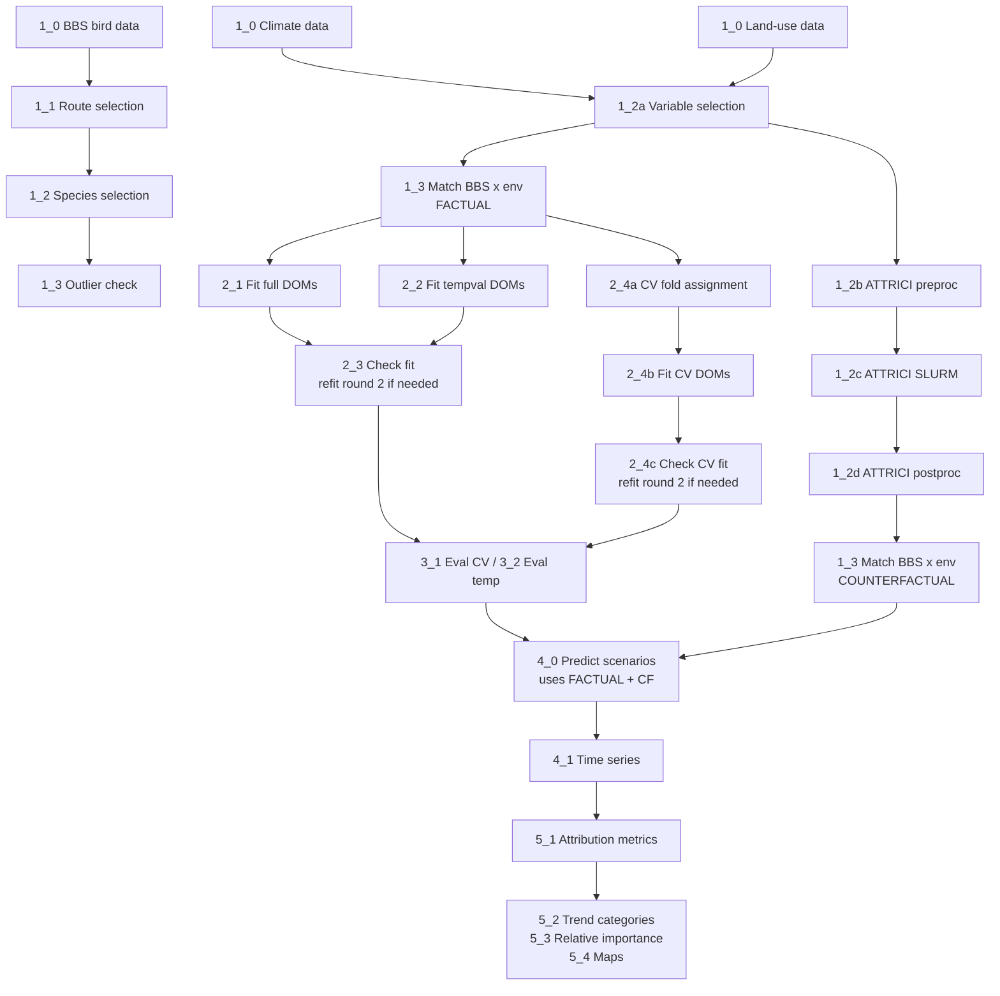

# Suggested additions to the README

> **Note (Guille, 2026-04-15):** Three self-contained blocks below that you could paste into the current README where they fit best. Each one stands on its own — feel free to take any subset, or none. I deliberately left the Workflow narrative untouched; these are meant as additions, not a replacement. This file accompanies `AUDIT.md` in the same branch.
>
> A separate, trivial change would be a find-and-replace to convert the absolute GitHub URLs in the current README to relative `scripts/X_Y.R` links (see AUDIT §1.4).

---

## Block 1 — Header metadata and citation

> Suggested placement: replace the first block of the current README (from the title down to the start of the Workflow section).

```markdown
# Disentangling climate and land-use forcing of continental bird occupancy change

**Authors:** Katrin Schifferle¹, [coauthors], Damaris Zurell¹
**Affiliations:** ¹ Ecology and Macroecology, University of Potsdam, Germany
**Funding:** [funding sources]
**Corresponding author:** schifferle@uni-potsdam.de

[](LICENSE)
[](https://doi.org/PLACEHOLDER)

## Abstract

[Insert paper abstract here before submission]

## Citation

If you use this code or build on this work, please cite both the paper and the archived code:

> Schifferle, K., et al. (2026). *Disentangling climate and land-use forcing of continental bird occupancy change.* Global Change Biology, [vol(issue)], [pages]. https://doi.org/[paper-DOI]

> Schifferle, K., et al. (2026). *UP-macroecology/Schifferle_BBS_occupancy_models_2023* [Code]. Zenodo. https://doi.org/[Zenodo-DOI]
```

---

## Block 2 — Workflow diagram

> Suggested placement: at the top of the `## Workflow` section, just before "### 0 - Functions", to give the reader a one-glance overview before diving into the narrative.

````markdown


Three branch points worth noting up front:

- **Factual / counterfactual loop** at `1_3_dataprep_match_BBS_routes_env_data.R`: run once with `data <- "factual"` and once with `data <- "counterfactual"`.
- **Refit loop** at `2_1`, `2_2`, `2_4b`: rerun with `round <- 2` for species flagged by the MCMC diagnostic step.
- **ATTRICI** is an external Python CLI (not R) — see "Setting up ATTRICI" in Block 3.
````

---

## Block 3 — Reproducing the analysis

> Suggested placement: as a new section between `## Workflow` and `## Operating system info`. Addresses the "how do I actually run this?" question that a reviewer or a new user opens the repo with.

```markdown
## Reproducing the analysis

### Software requirements

| Tool | Version | Notes |
|---|---|---|
| R | 4.3.1 | See `Operating system info` for full session info |
| CmdStan | ≥ 2.34 | Installed via `cmdstanr::install_cmdstan()` |
| ATTRICI | 1.1.1 | https://github.com/ISI-MIP/attrici (Python; SLURM) |
| GDAL | ≥ 3.6 | System dependency for `terra`, `sf` |

R packages: see the `Operating system info` section at the end of the README. We recommend installing them via `renv::restore()` once a `renv.lock` is provided (planned), or by manually installing the listed versions.

### External data

All raw datasets must be downloaded separately — the repository does not redistribute any third-party data. The sizes below are rough order-of-magnitude estimates; please replace them with the actual sizes of the files used in the analysis.

| Dataset | Source | Files needed | Approx. size | Access |
|---|---|---|---|---|
| BBS counts | https://www.sciencebase.gov/catalog/item/66d9ed16d34eef5af66d534b | Annual count files 1966–2023 | ~500 MB | Free, terms acceptance |
| BBS routes (shapefile) | https://purl.stanford.edu/vy474dv5024 | Route lines, lower 48 | <50 MB | Free |
| Bird Conservation Regions | https://www.birdscanada.org/bird-science/nabci-bird-conservation-regions | BCR polygons | <50 MB | Free |
| Climate (GSWP3-W5E5) | https://doi.org/10.48364/ISIMIP.982724.3 | tas, tasmin, tasmax, pr — 1995–2019 daily | [size] | ISIMIP account |
| Land use (ISIMIP3a) | https://doi.org/10.48364/ISIMIP.571261.3 | Annual land-use fractions 1995–2019 | [size] | ISIMIP account |
| Bird ranges (BirdLife) | http://datazone.birdlife.org/species/requestdis | Range polygons for the 80 modelled species | [size] | Formal application |

A short paragraph describing the folder layout that the scripts actually expect (e.g. where `data/`, the `Env_data/` subtree, the `CV_route_block_allocation/` outputs, and the NAS-based `results/` tree should sit relative to the repo root) would save the reviewer a guessing game. That's something I'd rather leave for you to write than invent from the outside.

### Setting up ATTRICI

ATTRICI is an external command-line tool used in step 1.2 to generate counterfactual climate. Install it from its repository before running scripts `1_2b`–`1_2d`:

```bash
git clone https://github.com/ISI-MIP/attrici.git
cd attrici && git checkout v1.1.1
# Follow upstream installation instructions (conda environment + dependencies)
```

The SLURM submission scripts `1_2c_attrici_US_*.sh` are written for our HPC environment and contain hard-coded paths — adapt them to your cluster before submission.

### Execution order

Run scripts in the numerical order shown in the workflow diagram. Three branch points:

1. After `1_2a`, prepare both factual and counterfactual environmental data: run `1_3_dataprep_match_BBS_routes_env_data.R` with `data <- "factual"`, then run the ATTRICI chain (`1_2b` → `1_2c` shell jobs → `1_2d`), then rerun `1_3` with `data <- "counterfactual"`.
2. After each fit step (`2_1`, `2_2`, `2_4b`), run the corresponding check script (`2_3a`/`2_3b` for full and tempval, `2_4c` for CV). For species flagged with MCMC issues, rerun the fit with `round <- 2`. Discard species that still fail.
3. Fitting the DOMs across all subsets is successful for 159 of the 192 selected species; 80 of these pass the spatial + temporal predictive performance filter and enter the attribution step.

### Compute notes

Steps `2_1`, `2_2`, `2_4b` (model fitting), `4_0` (scenario predictions), and `1_2c` (ATTRICI detrending) are computationally heavy and were run on HPC. Local execution is feasible only for the data preparation, evaluation, and plotting steps.
```
